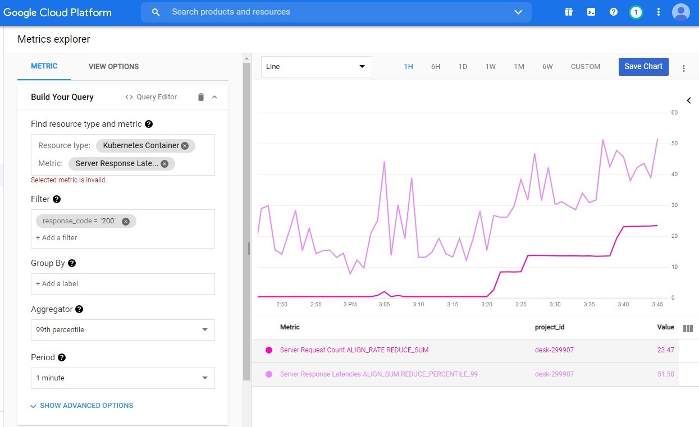

# GKE - native Istio and metering - integrate to StackDriver.

Terraform v0.14.3   
GKE 1.16.15-gke.4901   

 How is GKE and its Istio and Metering integrating with [ __Google Cloud's operations suite (formerly Stackdriver)__ ](https://cloud.google.com/products/operations) - Monitoring, Logging, Trace and Debugger.
 
  We observe to implementing _`rocketChat`_. So, it's two part of [GKE. free Istio. Rocket chat](https://github.com/r-mamchur/GKE_free_istio_rocketchat).
 
Install Terraform, kubectl, istionctl and Helm.   
But you can deploy https://github.com/r-mamchur/GCE_desktop_vm, there is everything.    

Terraform deploy infrascrukture - GKE cluster and BigQuery Dataset for it.   
(`Dataset` is need for `Metering Cluster` )

***kube-conf*** will be genereted by terraform from template. It allows access to the cluster (with kubectl, istioctl and helm).   
Copy it to `$HONE/.kube/config` or add `--kubeconfig="<Path>/kube-conf"` to command line.    

Add a namespace label to instruct Istio to automatically inject Envoy sidecar proxies when you deploy your application later:
```
kubectl label namespace default istio-injection=enabled
```

****Rocket Chat**** with Helm.    
WARNING: This chart is deprecated   
Chart Version	3.6.0   
Current Version	3.10.3   

Details:    
[https://docs.rocket.chat/installation/automation-tools/helm-chart](https://docs.rocket.chat/installation/automation-tools/helm-chart)   
[https://github.com/helm/charts/tree/master/stable/rocketchat](https://github.com/helm/charts/tree/master/stable/rocketchat)   
```
helm repo add stable https://charts.helm.sh/stable

helm install rocket stable/rocketchat  \
   --set replicaCount=2 \
   --set mongodb.mongodbUsername=rocketchat,mongodb.mongodbPassword=changeme,mongodb.mongodbDatabase=rocketchat,mongodb.mongodbRootPassword=root-changeme \
   --kubeconfig="./kube-conf"
```
Open the application to outside traffic.
```sh
# Get IP
export INGRESS_HOST=$(kubectl -n istio-system get service istio-ingressgateway \
      -o jsonpath='{.status.loadBalancer.ingress[0].ip}')

echo $INGRESS_HOST

# Generate server certificat and key
openssl req -newkey rsa:2048 -sha256 -nodes -keyout ./server.key \
     -out ./server.crt -x509 -days 365 \
     -subj "/C=UA/ST=Prykarpattia/L=Ivano-Frankivsk/O=Rohy i kopyta Inc./OU=Camel/CN=$INGRESS_HOST/emailAddress=r_mamchur@ukr.net"

# Configure a ingress gateway (TLS and not)  and VirtualService
kubectl apply -f GW_VS.yaml --kubeconfig=./kube-conf
```
Verify external access at $INGRESS_HOST (http and https).

#### StackDrive


####Issues:   
1. 
```sh
$ istioctl analyze
Warning [IST0002] (CustomResourceDefinition clusterrbacconfigs.rbac.istio.io) Deprecated: Custom resource type rbac.istio.io ClusterRbacConfig is removed
Warning [IST0002] (CustomResourceDefinition rbacconfigs.rbac.istio.io) Deprecated: Custom resource type rbac.istio.io RbacConfig is removed
Warning [IST0002] (CustomResourceDefinition servicerolebindings.rbac.istio.io) Deprecated: Custom resource type rbac.istio.io ServiceRoleBinding is removed
Warning [IST0002] (CustomResourceDefinition serviceroles.rbac.istio.io) Deprecated: Custom resource type rbac.istio.io ServiceRole is removed
```
2. [Google write:](https://cloud.google.com/istio/docs/istio-on-gke/overview#should_i_use)
> " Anthos Service Mesh or open source Istio are better options for production workloads."

3. Gateway didn't take up `server certificate`.

